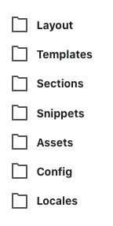
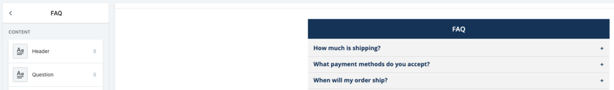

## Introduction

An FAQ interface is a straightforward way to provide your customers with the insight they need without the need to call customer service. In this tutorial, I will show you how you can take an existing collection template (irrespective of theme) and add an editable interface by way of [sections](https://www.shopify.com/partners/blog/introducing-sections-for-shopify-themes) in 5 easy steps.

This specific case leverages Bootstrap 3 Accordion techniques (as the theme was built with it), however all of this can be integrated via Bootstrap 4, other JavaScript toggling solutions and CSS only implementations.

My 5 step tutorial assumes you have basic/intermediate knowledge of Shopify, HTML/CSS and that you're able to read a JSON object (see [schema tags](https://shopify.dev/docs/themes/sections#using-section-schema-tags)).

## In The Trenches

### Step 1

First and foremost, you'll need to embrace Shopify's opinion on how code is organized.

Assuming you have access to your store, jump in to **Shopify Admin > Online Store > Themes**. From the **Actions** drop-down menu, click **Edit code** and you'll be navigated to the online code editor built into Shopify.



Take stock on how Shopify organizes its codebase. You cannot deviate from this opinion. It is a tight structure and the abstractions are intentional.

### Step 2

Navigate to **Sections** directory, click **Add a new section** and create this new file: `collection-faq.liquid`.

### Step 3

The [code](https://gist.github.com/marklreyes/33732847da71fa11771de8fd1c5874a7). Here's the breakdown of that in short order:

- **Line 7, 34:** The for loop keys off from schema settings defined from line 44.
- **Line 8, 10, 33:** A decision will be made to either print a header or a panel.
- **Line 23, 25, 27:** A decision will be made to either display or hide the answer.
- **Lines 40-91:** The required [schema tag](https://shopify.dev/docs/themes/sections#using-section-schema-tags) which ultimately defines your UI and its editable fields and initial settings.
- **Line 93, 94:** optional custom CSS styling to lay on top of this section.
- **Line 96, 97:** optional custom JavaScript to lay on top of this section.

### Step 4

Reference this newly created section to on your theme's collection template: `/templates/collection.liquid`

```

```

Frankly, you could add this interface to whatever template you see is most fitting for your use case.

### Step 5

Test it! Navigate to **Shopify Admin > Online Store > Themes** and click **Customize**.

Inside of the preview panel, click into a collection page which leverages your new addition. From there, you will see your FAQ settings on the left panel and a preview screen on the right.

<figure>



<figcaption>

Once inside of the Customize screen, you have full authority in adding/removing FAQs and previewing that in real-time.

</figcaption>

</figure>

Go ahead and add/remove a header, question and an answer! It won't save unless you click the **Save** button at the top-right.

## Conclusion

Sections are awesome. It's a great way to extend an established theme with your customizable interfaces.

If I have one _gotcha_ to reinforce it's this. Always revisit step 1. Acknowledge Shopify's file system and don't dance around it. The way it organizes its assets are very much intentional and if you can quickly accept the Physics of this particular world, you'll very much learn how do these kinds of tasks in 5 steps or less.

## Additional Resources

- [Liquid Template Language](https://shopify.github.io/liquid/basics/introduction/)
- [Using theme sections](https://shopify.dev/docs/themes/sections)
- [How to create a dynamic FAQ Section in Shopify](https://medium.com/@Cryptoctave/how-to-create-a-dynamic-faq-section-in-shopify-60152bf54fe4)
- [Bootstrap 3 Accordion Example](https://getbootstrap.com/docs/3.4/javascript/#collapse-example-accordion)
- [Bootstrap 4 Accordion Example](https://getbootstrap.com/docs/4.0/components/collapse/#accordion-example)
- [CSS only Accordion Example](https://codepen.io/raubaca/pen/PZzpVe)
