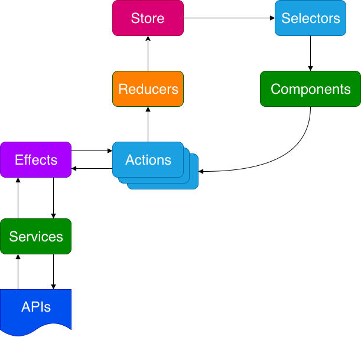

TLDR - A todo/task list built with Angular 9. This app utilizes Angular Material's drag and drop out of box and with the help of NgRx, the UI can maintain its previous state on page refresh.

* * *

## Features

- Provide sorting by table columns and searching.
- Add sorting by multiple columns and persist the sorting on refresh.
- Add the ability to drag and drop columns to reorder them using the native [Angular cdk drag and drop](https://material.angular.io/cdk/drag-drop/overview).
- Add ability to manually resize the columns by dragging with the mouse.
- Use Angular, RxJs and [NgRx](https://ngrx.io/) for state management.

## Demo

<iframe width="100%" height="420px" src="https://stackblitz.com/edit/angular-tasklist-ng9?embed=1&amp;file=src/app/components/home-page/home-page.component.html&amp;hideExplorer=1&amp;hideNavigation=1&amp;view=preview"></iframe>

## Conclusions

### Easy

Filtering a list of tasks leveraging a search bar was straightforward enough, thankfully. Check out the [pipe](https://stackblitz.com/edit/angular-tasklist-ng9?embed=1&file=src/app/pipes/filter-by-name.pipe.ts) and how that ties back into the `ngModel` on the input element for further details. My implementation is for the most part 1:1 from this [Stackblitz demo](https://stackblitz.com/edit/angular-vchhay).

### Medium

Imagine an excel spreadsheet in which you can resize the cells (see the purple drag handles on the To Do column). It's a similar ask here.

At the time of this writing, Angular Material does not fully support a way to resize elements. It was asked in [2019](https://github.com/angular/components/issues/14897) but I didn't find anything from the current documentation. I found this [ngx-cdk-drag-resize](https://stackblitz.com/edit/ngx-cdk-drag-resize) demo to be a good starting path leveraging Angular's [ElementRef](https://angular.io/api/core/ElementRef) API out of box.

The other gotcha was sorting by order. [AngularJS](https://docs.angularjs.org/api/ng/filter/orderBy) did it but Angular's core argument for not including that feature in their current API is simply for [performance](https://medium.com/sv-blog/where-is-your-orderby-pipe-angular-11e617ce2a3d). Your options are limited to creating your own custom pipe or having your component take on that responsibility. In my case, the [dynamicSort()](https://stackblitz.com/edit/angular-tasklist-ng9?embed=1&file=src/app/components/home-page/home-page.component.ts) function on my home page component is what I used to sort order attributes in ascending order.

### Hard

Saving the order of drag and drop. Saving the order on drag and drop and distinguishing between to do and done. Saving the order on drag and drop, distinguishing between to do and done, refresh the page and ensuring the previous state was maintained.

That. Was. Hard.

My initial thought was to save via [localStorage](https://developer.mozilla.org/en-US/docs/Web/API/Window/localStorage) but having localStorage fly on its own was brittle and often caused inconsistencies when ad hoc testing. I needed a strict approach that could thoughtfully manage the user interaction, namely [@ngrx/store](https://ngrx.io/guide/store) because at its core everything is immutable. Acknowledging that very rule was hard to embrace but in my opinion it's the way to go when creating insanely stable Angular web apps.

In my case, I used a combination of **reducers**, **actions** and **effects**.

It took me the better of two weeks just to understand NgRx on an elementary level so here's my tip on how to get through these dense concepts. _My suggestion assumes you've used Angular on a consistent basis and you're looking to add on top of your existing knowledge of that._

If you use Angular regularly then you're familiar with the green action below called **Components**. You might even be communicating with a backend system which means the other green action, **Services** and that blue document, **APIs** are also part of your web app flow. An abundance of Angular tutorials are demonstrated with just these ingredients alone. So if you're looking to spice it up with NgRx, add the following steps below.

#### Step 1

Review these additional actions and employ them where needed: **Store**, **Selectors**, **Reducers**, **Actions** and **Effects**.

#### Step 2

Follow the arrows. At all times, follow the arrows.

<figure>

<figcaption>

SOURCE: [Adding NgRx to Your Existing Applications](https://indepth.dev/adding-ngrx-to-your-existing-applications/)

</figcaption>

</figure>

Please feel free to fork [this](https://stackblitz.com/edit/angular-tasklist-ng9) into your own creation.

And remember, when all else fails...StackOverflow. 😉

Aloha. 🤙🏾

## Additional Resources

- [How To Build an App With Drag and Drop With Angular](https://medium.com/better-programming/how-to-make-an-app-with-drag-and-drop-with-angular-1c1d29b37d5d) (original source of inspiration sans JSON mock server)
- [5 Things I wish I knew about the CDK's Drag & Drop](https://fluin.io/blog/things-I-wish-I-knew-about-CDK-drag-drop) (when I got frustrated with CDK)
- [Adding NgRx to Your Existing Applications](https://indepth.dev/adding-ngrx-to-your-existing-applications/) (adding NgRx to the original source)
- [Save order on page refresh of cdkDrag, cdkDropList Angular Material](https://stackoverflow.com/questions/62437239/save-order-on-page-refresh-of-cdkdrag-cdkdroplist-angular-material) (when I needed consultation from the StackOverflow Gods)
