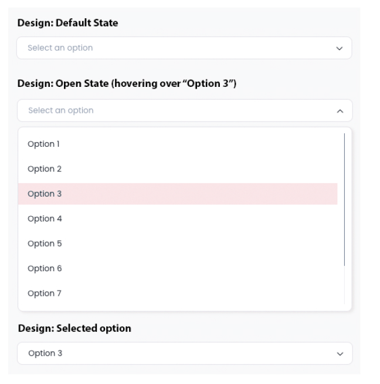
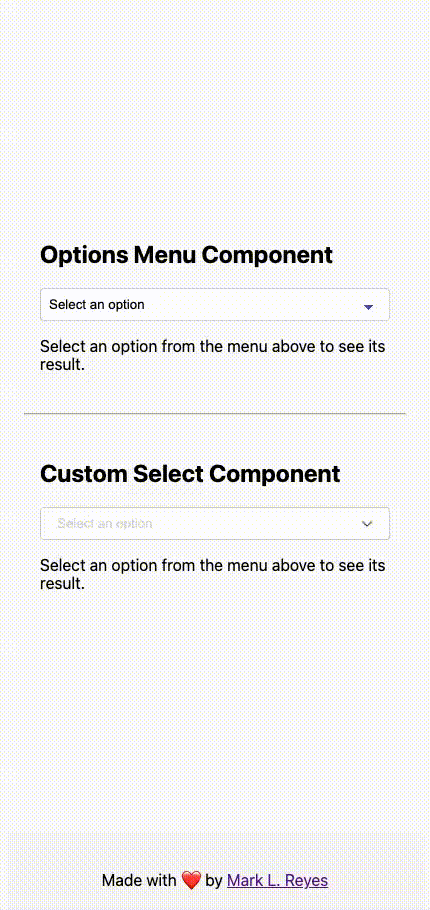

## The Challenge

Create a functional custom component (e.g. dropdown menu) using the Angular framework that matches the design exactly as shown below. Use the screenshot. No Figma available. 🙁🐼

### Guidelines

- Do not use premade UI libraries (such as Material, Bootstrap, Kendo, etc.).
- The code must be free of bugs and render correctly to pass the test.
- Please follow best practices and organize your code with appropriate structures. Use SCSS for styling.
- You are welcome to use the GSAP library to animate the dropdown menu if you wish.
- Icons (such as the “arrow”) can be handled in any way you prefer. Since you won't have the exact icon from the design,
feel free to use a similar icon or handle it with a PNG.
- Some design details (such as colors, border radius, etc.) have been intentionally left out.
- Please use your best judgment and the methods you normally rely on to determine these implementation details.

### Requirements

1. The dropdown must utilize a two-way binding that allows you to change the selected option.
2. If the external variable changes, the drop down should update to reflect the correct item.
3. If the dropdown selection changes, the value of the external variable should also update.
4. The dropdown should include a binding to set the placeholder label, which is displayed when no option is selected.
5. It must also feature a binding to dynamically change the available selections in the dropdown list.
6. When an option is selected in the dropdown, an event called `onSelection` should emit the identifier of the selected item.
7. The demo should demonstrate how this event is captured by the parent component.
8. If there are more than five items in the list, a scrollbar should appear to allow users to scroll through the options (This part may be challenging due to the custom design for the scrollbar).

## My First Draft

Instinctively, I felt something was already *amiss*. But I couldn't put a pin on it quite yet. Lately, my headspace has been trending more towards React with the advent of version 19, NextJS aligning to that major release, and above all else this Astro world I'm currently in. Read *[Goodbye WordPress. Hello Astro!](/blog/goodbye-wordpress-hello-astro)* for more details.

I digress. My bad.

*Back to the lecture at hand*...pivoting back to the bread and butter of Angular (IMO, two-way binding) my thought process was to kick out requirements 1-5 by way of a parent-child component setup to transmit data from `OptionsMenuComponent` back into its parent, `AppComponent`.

By way of a [Reactive forms](https://angular.dev/guide/forms/reactive-forms#) approach alongside [@Input](https://angular.dev/guide/components/inputs#declaring-inputs-with-the-input-decorator) and [@Output](https://angular.dev/guide/components/outputs#declaring-outputs-with-the-output-decorator) decorators at my side, I figured I had a shot at emitting the selected value back to `AppComponent` and that'd be that!

So far so good...

That's when my spidey senses finally kicked in and where I found myself in the crossroads. To this day, this Stack Overflow thread ages very well, [How to style the option of an HTML select element?](https://stackoverflow.com/questions/7208786/how-to-style-the-option-of-an-html-select-element), in that you can't style the actual HTML option element without intervention of a library.

Whoah, whoah, whoah! Slow down, sailor. Don't go npm installing just yet. You're still at the mercy of the browser and operating system, so yea...ummm...!@#$%^&*!

Let's end the component [here](https://github.com/marklreyes/angular19-custom-select-component/tree/main/src/app/components/options-menu) and try something else.

## My Renaissance

Building off of what I previously wrote I knew that I'd maintain the parent-to-child relationship using the previous decorators and that the road to requirements 6-8 went through customizing the "option" element.

Rather than being so committed to classic HTML form implementations using tags like `form`, `label`, `input`, `select`and `textarea` I decided to run with `div` elements paired with a `button` element (heads up...I fracked in portions of the screenshot to make arrows) so I could better control the styling portion. Pairing that alongside some magic available from `@angular/forms`, specifically [ControlValueAccessor](https://angular.dev/api/forms/ControlValueAccessor) interface and [NG_VALUE_ACCESSOR](https://angular.dev/api/forms/NG_VALUE_ACCESSOR#) constant, bridged the gap between DOM elements to the Angular forms API, allowing me to keep parity to my previous efforts by emitting the value selected back to `AppComponent` through the `onSelection` method defined in that respective parent.

## The Finale

Today, chefs, I prepared for you a coconut-curr...I mean a [functional dropdown menu using the Angular framework](https://stackblitz.com/github/marklreyes/angular19-custom-select-component?file=README.md) to match the design provided by the supplied screenshot.

I decided to save the previous component as an appetizer to illustrate the stark contrast in menu display between this and the respective entrée.

## Conclusion

Outside of styling the improbable, what I found to be most interesting was dabbling with deferrable views on `AppComponent` using blocks like `@defer`, `@loading`, `@error` and `@placeholder`. Was it necessary for a UI this small? Maybe. Maybe not. But employing tools already stuffed inside of your back pocket to help reduce initial bundle size is always a fun thing to explore.

### Vibe Coding

Honestly, my mental cardio **DIED** when I couldn't God mode the style palette for the original component. Thus, a sit down with GitHub CoPilot through VS Code was certainly used. That said, in order to keep Maverick from gun slinging a bit too much I stubbed in Angular's pseudo-class selector called `:host` to target that component directly. That's more of a placeholder for *Future Mark* in the event *he* wants to refine the CSS in a different direction.

> It’s not the plane, it's the pilot.
>
-- <cite>Top Gun: Maverick</cite>

### About Options Service

I probably could've just stubbed the [data](https://github.com/marklreyes/angular19-custom-select-component/blob/main/src/app/data/data.ts) closer to the components but I wanted to fake an API call to play around with the modern-day way of dependency injection through `inject()` and test out the concept of deferrable views. Big thanks to Mark Thompsen's [Angular 17+ Fundamentals](https://frontendmasters.com/courses/angular-fundamentals/) course on Frontend Masters to play around with the idea. Watch that, and it'll explain why I mucked with an asynchronous `ngOnInit()` lifecycle hook.

### Final Thoughts

Some of these thoughts were courtesy of habits infused in a pre-renaissance ng-world, so a few more mental model updates are needed but it's been fascinating to see how Angular v17+ has come back to let me know that they've still got it going on as the one-stop shop for single-page web apps.

Have some fun and feel free to fork the repo or PR back to [Angular 19 Custom Select Components Demo](https://github.com/marklreyes/angular19-custom-select-component). Dependabot is enabled so dependencies are up-to-date!

Thanks and Aloha! 🤙🏾
