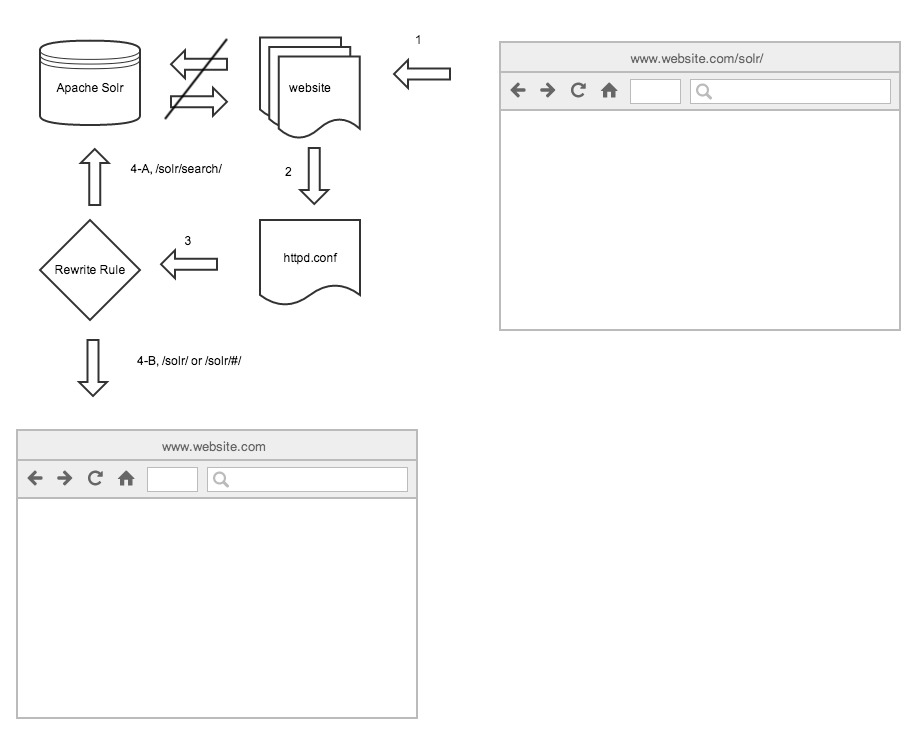

After exposing the Solr endpoint with a [reverse proxy](/reverse-proxy-a-solr-instance/), it's important to note that it also exposes the Solr admin panel to the end-user. This is not desired.

[](http://www.marklreyes.com/wp-content/uploads/2014/05/rewrite_rule.jpg) Flowchart of a RewriteRule directive that rests on website.com’s httpd.conf file.\[/caption\]

## Problem:

- Solr's admin panel becomes exposed from the reverse proxy.

## Solutions:

- Perform a redirect to website.com's homepage.
- RewriteRule directive, [mod\_rewrite - Apache HTTP Server](http://httpd.apache.org/docs/2.2/mod/mod_rewrite.html#rewriterule).

```
	RewriteRule ^/solr/$ / [R=301,L,DPI]
```
