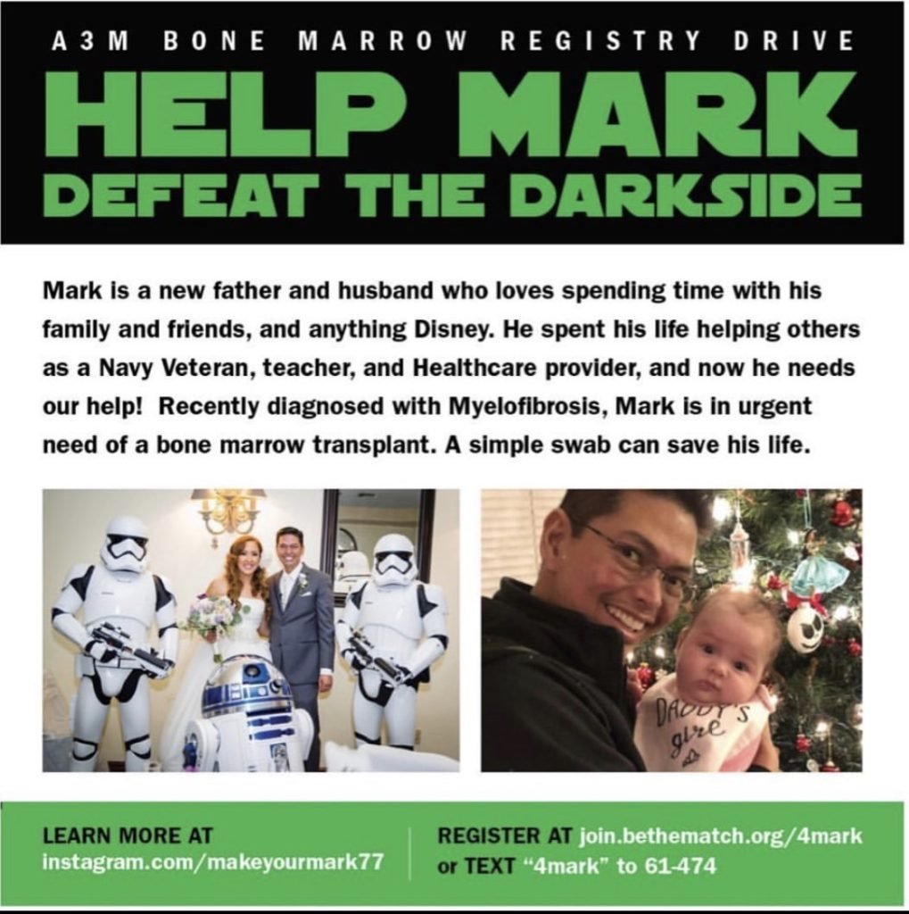
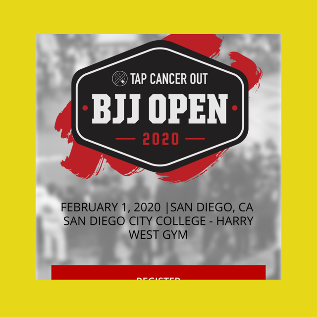
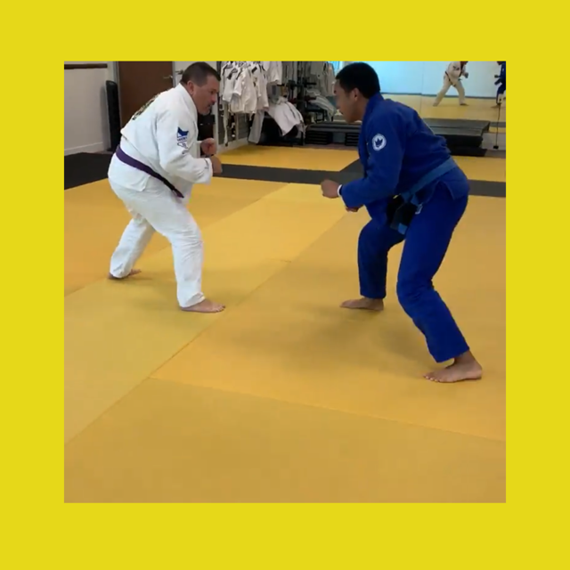

For 2020, I wanted to do my part in combatting cancer so I'm going head first personally in two campaigns. They are in no particular order - all are equally important. Please see below.

## [#makeyourmark77](https://www.instagram.com/makeyourmark77/)

<figure>

<figcaption>

I met Mark by way of some old friends at the onset of my web development career. Mark, alongside some of my other awesome peers got me into things I thought I'd never do like playing Dungeons and Dragons. He's my and many others personal _Jeff Goldblum_. I'm here letting you know that he needs our help. He's in need of a bone marrow transplant and we're looking for donors especially of Filipino 🇵🇭descent (where there's a higher match of probability). Signing up for a kit and conducting a swab procedure could be the 15 minutes that saves his life. Please visit [#makeyourmark77](https://www.instagram.com/makeyourmark77/) and spread the word. Aloha 🤙🏾

</figcaption>

</figure>

## [#tapcancerout](https://wecan.tapcancerout.org/markreyes)

- <figure>

    

    <figcaption>

    Tap Cancer Out is on February 1, 2020 in San Diego, CA.

    </figcaption>

    </figure>

- <figure>

    

    <figcaption>

    Dave and I tinkering with some stand-up.

    </figcaption>

    </figure>

In 2020, I’ll be fighting. However, this is no ordinary fight. I am taking part in the Tap Cancer Out BJJ Open and along with my teammates at Ribeiro Jiu Jitsu Carlsbad and competitors, I'll be fighting for those who are in the fight of their lives -   children with cancer.

**I'm raising funds in support of [Tap Cancer Out](https://wecan.tapcancerout.org/markreyes), a 501(c)(3) charitable organization, and their beneficiary organization—**[**Alex's Lemonade Stand**](https://www.alexslemonade.org/)**.**

<iframe width="560" height="315" src="https://www.youtube.com/embed/xeBulgVzSvs?rel=0" frameborder="0" allow="accelerometer; autoplay; encrypted-media; gyroscope; picture-in-picture" allowfullscreen></iframe>

Since 2012, tournaments like this one have helped Tap Cancer Out raise and donate more than $1.36 million for various cancer causes including the Leukemia & Lymphoma Society,  St. Baldrick's, and the Pancreatic Cancer Action Network.

**I would be honored if you'd support my fundraising efforts with a donation.** It's secure and 100% tax deductible. If you'd prefer to pay by check, please mail to: Tap Cancer Out, 2 Enterprise Dr, Suite 307, Shelton, CT 06484.

If you can't make a donation at this point, help me reach my goal by sharing this page on Facebook and/or Twitter! Or, even better, send an e-mail to friends you think might be interested in contributing and include a link to my page!

Thanks so much for your generosity!
