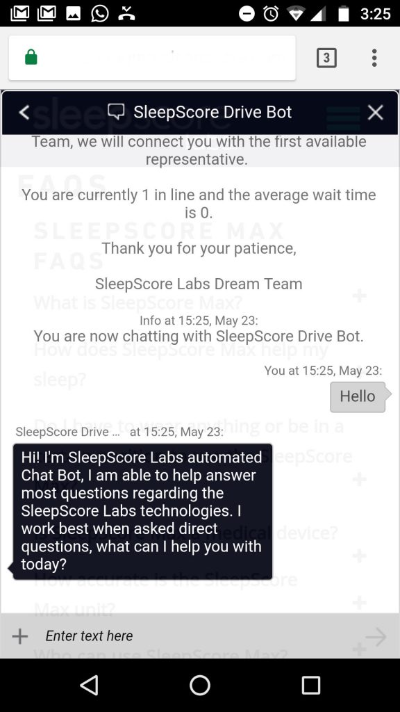

In lieu of SleepScore Labs newest sleep solution, _SleepScore App_, our Customer Service team wanted to create a chat alternative to support this product launch.

Over the course of three furious weeks (one to vet out the needs, and two to build), I worked one-on-one with our Customer Service Manager on outlining the bare minimum of what we'd really want in this type of feature.

It's safe to say, that you can get trapped inside of a rabbit hole fairly quickly with ideas but after easing in a bit our solution was to design an FAQ (Frequently Asked Questions) Chatbot.

We took as much existing data we could from previous customer service engagements, organized them a bit and indexed them within a Web Service called [QnA Maker](https://www.qnamaker.ai/). I connected that dot to a [Microsoft Azure Bot Service](https://azure.microsoft.com/en-us/services/bot-service/) as a NodeJS Web App and published it to a channel called [Live Assist](https://www.cafex.com/en/products/live-assist-365/).

\[caption id="attachment\_453" align="alignnone" width="576"\] A NodeJS chatbot powered by QnA Maker, Microsoft Azure and channel, Live Assist.\[/caption\]

Housed entirely inside of Microsoft products, I was for the most part impressed on how straightforward it was to put all three together to build out something real customers could actually engage with. There was no additional coding on my part and getting to the finish line on time was in itself a win.

If you ever wanted to try building this out yourself here's the bare minimum you'd need:

- [QnA Maker](https://www.qnamaker.ai/): which will index your questions and answers and open an end-point for your web app (chatbot) to consume.
- [Azure Bot Service](https://docs.microsoft.com/en-us/azure/bot-service/bot-service-quickstart?view=azure-bot-service-3.0): which is actually how you create the chatbot.

The optional requirement here is the _channel_. Building out a chatbot requires you to point your chatbot to a channel. In our case it was Live Assist because that was the requirement. But this could easily ship to other channels like Facebook, SLACK, etc.

I'll be making a follow-up post to this for the most part as a retrospective to outline the journey and its gaps to this implementation in hopes that one day I have the opportunity to make more improvements at this first pass on building out a chatbot.

Thanks to, [Microsoft Developer US](https://www.youtube.com/watch?v=Bp33vjtE0cw) for getting me started.
