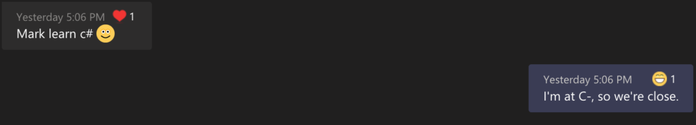
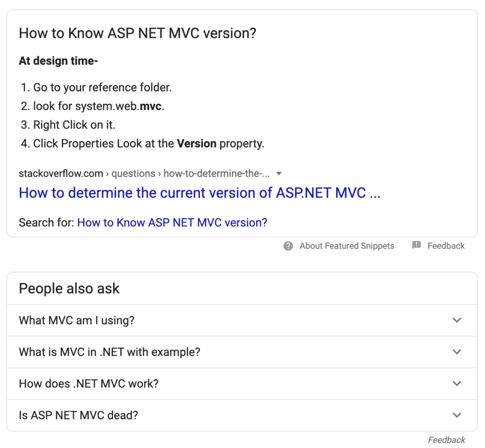
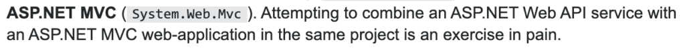

TLDR – With the exception of Flash, I've been all in with JavaScript since the start of my career. That said, my current company maintains a few legacy applications built primarily in the [.NET framework](https://dotnet.microsoft.com/). Due to resource constraints and being in that _start-up life_, I was tasked to help support these existing systems. Long story short, this is a tale on how a JavaScript Developer went head first into C#.

* * *

<figure>



<figcaption>

I guess I'll start at the beginning.

</figcaption>

</figure>

* * *

## Research

Flying by the seat of my pants from that previous inquiry, I went in the next day on a mission. Cringing alongside my keystrokes, I prayed then dove into the rabbit hole.

Google Search: _[](https://www.google.com/search?q=how+do+you+know+if+it%27s+.NET+mvc&oq=how+do+you+know+if+it%27s+.NET+mvc&aqs=chrome..69i57.559j0j1&sourceid=chrome&ie=UTF-8)[learn c#](https://www.google.com/search?q=learn+c%23&oq=learn+c%23&aqs=chrome..69i57j69i60l3.361j0j1&sourceid=chrome&ie=UTF-8)_.

Google's SERP displayed this website organically at #3, [learncs.org](https://www.learncs.org/).

Start the clock at 112pm PDT.

## Gotcha 1

> "_C# is object oriented and its syntax is very similar to Java._"
>
> Chapter: Hello World

> "Lists in C# are very similar to lists in Java"
>
> Chapter: Lists

> "For loops are very similar to for loops in C"
>
> Chapter: For Loops

Hi, My name is Mark and I do _JavaScript_. What's in it for me?

### Gotcha 2

I just wanted to write a [variable](https://www.learncs.org/en/Variables_and_Types).

```
// Write a variable in C#, FIRST PASS.
string productName = 'TV';
Console.WriteLine("productName: " + productName);

// Output, FIRST PASS:
error CS1012: Too many characters in character literal
Compilation failed: 1 error(s), 0 warnings

// Write a variable in C#, NEXT PASS.
string productName = "TV";
Console.WriteLine("productName: " + productName);

// Output, NEXT PASS:
productName: TV
```

Okay, so _single-ticks_ are off the table. Thanks.

### Gotcha 3

How many different ways can you define a list of values in C#? In JavaScript you have an [Array](https://developer.mozilla.org/en-US/docs/Web/JavaScript/Reference/Global_Objects/Array) (irrespective of flat or multi-level). But in this world, these data abstractions are bundled either into [Arrays](https://www.learncs.org/en/Arrays), [Lists](https://www.learncs.org/en/Lists) and [Dictionaries](https://www.learncs.org/en/Dictionaries).

It makes sense when do a deep dive into the minutiae. Arrays are still simply arrays. Lists are essentially a more dynamic Array for when you don't know how many variables to truly hold. Dictionaries are like phone books (e.g. a collection of names and phone numbers).

### Gotcha 4

Writing a [method](https://www.learncs.org/en/Methods) and assign a modifier to it. Public, static?

```
// Structure
[Modifiers (E.G public or static)] [Type of output] [Name] ( [parameter 1],[parameter 2] ...)
{

}
// Multiply method example
public static int Multiply(int a, int b)
{

    return a * b;

}
```

It appears similar to what I see when [TypeScript](https://www.typescriptlang.org/docs/handbook/classes.html) seasons a Class setup from the object oriented approach.

I now share these sentiments but sitting from the other side of the table:

> _Traditional JavaScript uses functions and prototype-based inheritance to build up reusable components, but this may feel a bit awkward to programmers more comfortable with an object-oriented approach, where classes inherit functionality and objects are built from these classes._
>
> [https://www.typescriptlang.org/](https://www.typescriptlang.org/)

## Gotcha 5

> _Until you learn more advanced programming, you will have to use to_ `_public_` _modifier in separate classes._
>
> Chapter: Basic Classes

I guess anything I write will be accessible by any other object for now. Apologies in advance. 🙏🏾

## Conclusion

Stop the clock at 429pm PDT.

The final lesson was complete. Dead stop. No celebrations. No confetti. Not even a sliver of text saying, _Good job_. Boo - I was hoping for more. This slight is simply a critique for how the movie ended. The overall tutorial was good, condensed just enough so that the learning curve wasn't steep.

For me, the only way to truly relate to an object oriented programming language will have to be through the lens of a TypeScript user. So if you already involve type checking in your JavaScript setups, I'd recommend you look at it from that context.

What's next you ask? Ultimately, it's about leveling up so my next set of research rests within the context of a web app (namely the legacy app to maintain).

## A Few Minutes Later

The app is pulled down to my local machine, I've popped open Visual Studio. Let's wrap this up!

Google Search: _[how do you know if it's .NET mvc](https://www.google.com/search?q=how+do+you+know+if+it%27s+.NET+mvc&oq=how+do+you+know+if+it%27s+.NET+mvc&aqs=chrome..69i57.559j0j1&sourceid=chrome&ie=UTF-8)_

<figure>



<figcaption>

Is ASP NET MVC dead? Let's revisit that later. 🧐

</figcaption>

</figure>

4 steps later, I can confirm that the Identity is "System.Web.Mvc" and the current version of this legacy system is [5.2.7.0](https://www.nuget.org/packages/Microsoft.AspNet.Mvc). _So far_, no [EOL plan](https://dotnet.microsoft.com/platform/support/policy/aspnet), whew. Dodged bullet 1.

Let's circle back to that previous [result](https://stackoverflow.com/questions/51390971/im-lost-what-happened-to-asp-net-mvc-5), yes?

<figure>



<figcaption>

F\*ck.

</figcaption>

</figure>

The End.
