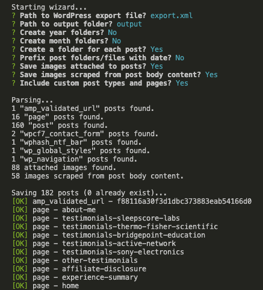
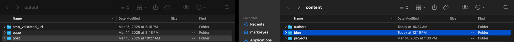

## Goodbye WordPress. Hello Astro!

For the TLDR edition, please read [State of Static Blogs with Foreword by Mark
](/blog/state-of-static-blogs-with-foreword-by-mark).

Otherwise...sit back and enjoy these next few minutes, and welcome to *Goodbye WordPress. Hello Astro!*

### Goodbye WordPress 🖤

Dear WordPress, since '09 you've been there for me like no other. I'll always remember how this ecosystem got me into web development. Through MAMP/XAMPP (hi, XP), to mucking with `header.php` and `footer.php` to get styles or logic into a global context (probably wasn't necessary), fracking CSS through child themes with `!important` as unlimited ammo, to feasting on plugin after plugin like it's Thanksgiving, it's been pretty cool to see how this ecosystem has grown from *Personal Home Page* to what it is today.

The release of Gutenburg block editor, allowing REST APIs since 4.7, the advent of Local by Flywheel to simplify local development and the emergence of dedicated hosting providers like WP Engine are what kept me with you. Had none of those things occurred, I probably would've flipped a table then regressed to FTP'ing an `index.html`
file.

That said, it's time for me to go. But I won't leave you hanging with any doubt, whatsoever. It was honestly due to these [6](/blog/state-of-static-blogs-with-foreword-by-mark) objectives.

### Hello Astro 🚀

I have no intention of repeating everything that appears on your [personal home page](https://astro.build/). 😏

But yes, it was quite convincing. So I guess I'll explain my *why* by way of a user story.

<blockquote>
As Mark, I want a low-to-no-cost blogging system that I can work with quickly, so I can ship it to prod ASAP.
</blockquote>


#### My Playbook 📓

This playbook is very specific. It works under the assumption that you've chosen your [theme](https://astro.build/themes/) and opted in to [Netlify](https://www.netlify.com/) as your final destination.

##### **1. Back That Thang Up**

🎶 *Cash Money Records, taking over for the '99 into 2000...*

* Insurance policy (required) - Export your content from your WordPress Dashboard [Tools > Export](https://wordpress.org/documentation/article/tools-export-screen/). This spits out an `.xml` file.
* Insurance policy (optional) - If you have the luxury of WordPress dedicated hosting such as [WP Engine](https://wpengine.com/support/restore/), they have an automated backup feature. Download the latest zip file, just in case!

🎶 *...(nah, nah, nah, nah, nah)...After you back it up, then stop...*

##### **2. Return of the Mack**

🎶 *Ooh-oh-oh, come on...Hey, yeah, ay...Well, I tried to tell you so (yes, I did)...But I guess you didn't know...*

* It's time to come back from nothing. In this case, with [wordpress-export-to-markdown](https://github.com/lonekorean/wordpress-export-to-markdown) to convert your WordPress contents to Markdown for consumption later down the road within your Astro theme.
* Take your `xml` file and rename it to `export.xml` per Will's suggestion and make life easier for yourself. Drop it like it's hot into the same directory that you run the script from.

```
	npm install && node index.js
```

*After running the command, the Node app should output a similar report of what's saved.*

🎶 *...You lied to me...All this pain you said I'd never feel...You lied to me...But I do...But I do, do, do...*

##### **3. Not Like Us**

🎶 *Wop, wop, wop, wop, wop...I'ma do my stuff...*

182 posts.

Irrespective of volume, this is the next stop as we move the ball down field and depending on how old your posts are, special care is required.

* Take the contents of `/output` directory of [wordpress-export-to-markdown](https://github.com/lonekorean/wordpress-export-to-markdown) and drag that over into your Astro theme's `/blog` directory.


*Drag contents of the output directory (e.g. post) into your theme's blog directory.*

> :warning: **DISCLAIMER:** Take your time. It's at this point where beauty is in the eye of the beholder (aka **YOU**). In my case, that's 182 posts (I didn't even talk about pages) circa 2013 onward. I needed to see how the old stuff drew to the screen before publishing. I had to double-check each article to ensure that the markdown and display was in an acceptable format (fixing broken iframes, centering things again, etc.). Also, not every piece of data is exported to markdown. Most noticeably Yoast SEO contents. It also meant getting scrappy with Photoshop again to make featured images because honestly, that wasn't always a thing many many moons ago.

🎶 *...Are you my friend?...Are we locked in?...Then step this way, step that way...Then step this way, step that way...*

##### **4. Hypnotize**

🎶 *...Uh, uh (uh, come on)...Ha, sicker than your average, Poppa twist cabbage off instinct...Brothers don't think stuff stink...Pink gators, my Detroit players...Timbs for my hooligans in Brooklyn (that's right)...*

I'm not messing around with 182 posts, period. Time to redirect!

* If you have a few redirects, insights from [Kedasha's URL Redirects](https://www.itsthatlady.dev/blog/migrate-from-wordpress-to-astro/) is perfect.
* Otherwise, I went with [Cassidy's setup using Netlify Redirects with Astro](https://cassidoo.co/post/netlify-redirects-astro/).


🎶 *...Biggie, Biggie, Biggie, can't you see?...Sometimes your words just hypnotize me...*

##### **5. The Next Episode**

🎶 *...La-da-da-da-da...It's the motherlovin' D-O-double-G (Snoop Dogg)...La-da-da-da-da...You know I'm mobbin' with the D-R-E...Yeah, yeah, yeah...You know who's back up in this motherlover...*

* This is arguably the most stressful part. No matter who controls your DNS setup, they all clap back with the "up to 24 hours" disclaimer for DNS propagation. In my case, [Delegate to Netlify](https://docs.netlify.com/domains/set-up-netlify-dns/#delegate-to-netlify) was the route to take.

🎶 *...💨🌱 every day...*

### Real-Time QA 🧐

🎶 *...What we're gonna do right here is, go back...Way back, back into time...*

Let's test things outside of my control! Here's your chance to QA links I can't edit myself.

#### Steps to Reproduce - Issue 488
1. Visit [JavaScript Weekly Issue 488](https://javascriptweekly.com/issues/488)
2. Click article, *The Tale of Upgrading a Legacy Angular App*
3. Astro x Netlify x MarkLReyes.com ✅

#### Steps to Reproduce - Issue 517
1. Visit [JavaScript Weekly Issue 517](https://javascriptweekly.com/issues/517)
2. Click article, *Reading John Resig's 'Pro JavaScript Techniques' 14 Years Later*
3. Astro x Netlify x MarkLReyes.com ✅

🎶 *...If you take your love away from me...I'll go crazy, crazy, crazy insane...If you take your love away from me...I'll go crazy, I'll go insane (oh)...*

### Mahalo and Aloha 🤙🏾

🎶 *...I was young and didn't have nowhere to run...I needed to wake up and see what's in front of me...There has to be a better way...*

I was able to retire Cloudflare, WP Engine (saved 💰) and WordPress safely upon change. That said, those aforementioned technologies are still **very good** but this domain needs something else.

#### Fun Facts
- **Start date of project:** March 13, 2025
- **End date of project:** March 17, 2025
- Over time, the subset of pages exported were no longer applicable. The [About Page](/about) was really the only thing valid at the time of this project.
- AI was used once. Specifically in VS Code with my GitHub CoPilot extension generating suggestions when using the existing [Authors Card Component](https://github.com/jktrn/astro-erudite/blob/main/src/components/AuthorCard.astro) as my source of inspo.

#### Flowers, Gratitude and Thanks

- [How I Migrated from WordPress to Astro](https://www.itsthatlady.dev/blog/migrate-from-wordpress-to-astro/) 💐
- [Setting up Netlify Redirects with Astro](https://cassidoo.co/post/netlify-redirects-astro/) 💐
- [List all URLs](https://wordpress.com/plugins/list-all-urls) 💐
- [astro-erudite](https://github.com/jktrn/astro-erudite) 💐
- [wordpress-export-to-markdown](https://github.com/lonekorean/wordpress-export-to-markdown) 💐
- [The ultimate Astro + Google Analytics guide](https://daniel.es/blog/the-ultimate-astro-google-analytics-guide/) 💐

🎶 *...You don't know how much you mean to me...'Cause even though when times got rough...You never turned away, you were right there...And I thank you, thank you...When I felt I had enough...You never turned away, you were right there...And I thank you, thank you...*

### Spotify Playlist 🎧
<iframe style="border-radius:12px" src="https://open.spotify.com/embed/playlist/3zysyxuswAXKFKxEGi3iW4?utm_source=generator&theme=0" width="100%" height="152" frameBorder="0" allowfullscreen="" allow="autoplay; clipboard-write; encrypted-media; fullscreen; picture-in-picture" loading="lazy"></iframe>

By the time you reach the bottom of this page, the build should be a success. 🫡
<div>
	<a href="https://app.netlify.com/sites/marklreyes/deploys">
		
	</a>
</div>
