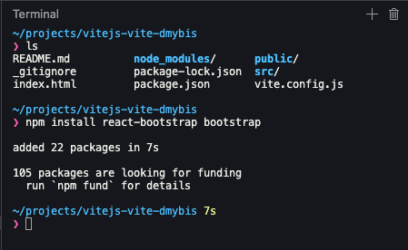
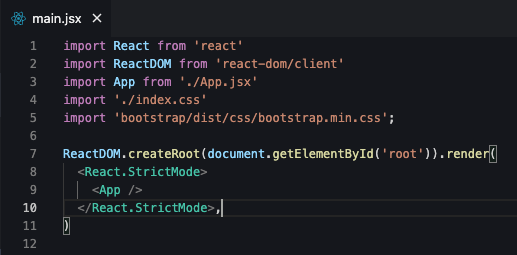
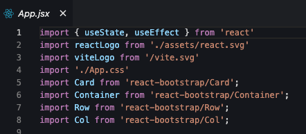
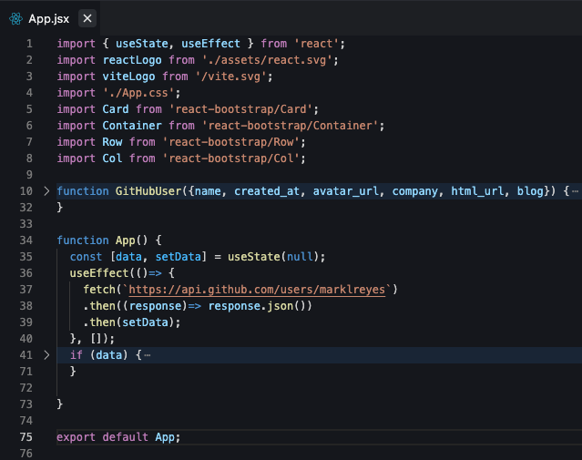
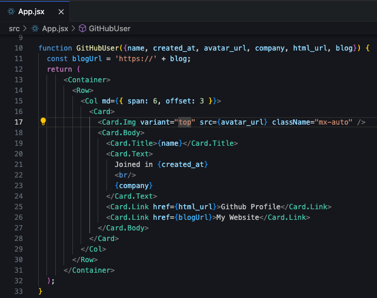
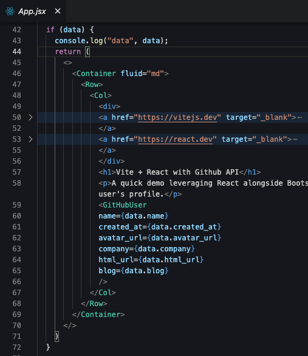

I'm dabbling with React 18, displaying data in a separate component using hooks and fetch.

* * *

## Introduction

Let's build this. A simple React app which accesses Github's REST API and prints a user's profile into a Bootstrap 5 card interface.

<iframe width="100%" height="420px" src="https://stackblitz.com/edit/react-vite-dmybis?embed=1&amp;file=src%2FApp.jsx&amp;hideNavigation=1&amp;view=preview"></iframe>

## What's the Goal?

Create a separate component that displays a person's Github profile.

## What will we need?

- **[Stackblitz](https://stackblitz.com/)** - to quickly prototype a React project and its dependencies.

- **[React Bootstrap 5](https://react-bootstrap.netlify.app/)** \- to grab some ready-made user interfaces (e.g. cards).

- **[useState](https://react.dev/reference/react/useState)** - to handle the data.

- **[useEffect](https://react.dev/reference/react/useEffect)** - to make the call for external data.

- **[Github REST API](https://docs.github.com/en/rest?apiVersion=2022-11-28)** \- the data source we'll need to access and display a user's profile.

## Step By Step

### Step 1: Create React App

<figure>

<figcaption>

From Stackblitz, click _New project_ button and choose _React JavaScript_.

</figcaption>

</figure>

### Step 2: Install Dependencies

<figure>

<figcaption>

From Stackblitz, open a new terminal and run: npm install react-bootstrap bootstrap

</figcaption>

</figure>

### Step 3: Add Dependencies

<figure>

<figcaption>

From Stackblitz, add line 5 of main.jsx, import bootstrap.min.css.

</figcaption>

</figure>

<figure>

<figcaption>

From Stackblitz, add lines 5-8 of App.jsx, import React components Card, Container, Row, Col.

</figcaption>

</figure>

### Step 4: Setup Hooks in Function, App()

<figure>

<figcaption>

From Stackblitz, App.jsx.

</figcaption>

</figure>

- **Line 1:** import _useState_ and _useEffect_.

- **Line 35:** set a constant which de-structures an object called _data_ and a method called _setData_ which initially sets the _data_ object's value to _null_.

- **Line 36, 40:** set up useEffect() method and pass in a callback function. Take note of line 40, where an empty array is assigned in order to make this request once when the application first renders.

- **Line 37:** use built-in _fetch_ method from the browser to make an HTTP request from Github's API.

- **Line 38, 39:** The first _then_ takes the response and turns it into JSON and chaining in another _then_ method will take the result of that JSON and pass it into the _setData_ method defined on line 35.

- **List 41, 71:** Set up an if statement to return the HTML if data exists.

### Step 5: Create Function, GitHubUser()

<figure>

<figcaption>

From Stackblitz, App.jsx, lines 10 through 33.

</figcaption>

</figure>

- **Line 10:** pass in the props of your choice for display. In my case, _name_, _created at_, _avatar url_, _company_, _html url_ and _blog_ keys have the values I want to display as HTML elements on the page.

- **Line 11, 26:** Concatenate secure protocol since it was not included in the original API call and pass that into the Card Link component.

<figure>

<figcaption>

From Stackblitz, App.jsx, lines 59 through 66.

</figcaption>

</figure>

- **Line 59 - 65:** Once the conditional (line 41, 72) evaluates to true, the _data_ object will be available for props to be passed into the GitHubUser component.

## Key Takeaways

Outside of a successful call, data can be coming in many different states such as loading and error. This is due to the dependency of calling in a third party API. Extend this example by leveraging additional useState hooks, conditional rendering and _catch_ method to display HTML which reflects those different use cases.

## Additional Resources

- LinkedIn Learning - [React.js Essential Training](https://www.linkedin.com/learning/react-js-essential-training-14836121)

- Source code for this demo is available on [Github](https://github.com/marklreyes/react-vite-githubapi) and [Stackblitz](https://stackblitz.com/~/github.com/marklreyes/react-vite-githubapi).

- If you want to make a context switch to [Vue](https://www.marklreyes.com/vue-components-bootstrap-card-github-api/), a similar implementation can be found [here](https://www.marklreyes.com/vue-components-bootstrap-card-github-api/).
