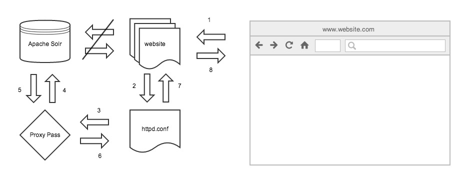

It's encouraged that you secure your Solr instance by placing the application on a different file server and behind a firewall. That's an issue if you are trying to consume data from the Solr instance leveraging AJAX techniques.

\[caption id="attachment\_249" align="alignleft" width="920"\][](http://www.marklreyes.com/wp-content/uploads/2014/05/reverse_proxy.jpg) Flowchart of a reverse proxy directive that rests on website.com's httpd.conf file.\[/caption\]

## Problems:

- www.website.com and Apache Solr live on separate boxes.
- A firewall protecting Apache Solr plus the cross-domain issue does not expose the necessary end-point to consume via AJAX.
- Depending on your sys admin setups, Solr may not live on a fully qualified domain (ie. http://12.34.56.789:8983/solr/#/)
- An AJAX call to consume the Solr instance's JSON/XML won't work cross-domain.

## Solution:

- Reverse Proxy directive, [mod\_proxy - Apache HTTP Server](http://httpd.apache.org/docs/2.2/mod/mod_proxy.html)
- This allows for an endpoint that is visible to the browser and we can consume the JSON/XML that rests within the Solr instance.

```

ProxyPass /solr http://12.34.56.789:8983/solr/#/
ProxyPassReverse /solr http://12.34.56.789:8983/solr/#/
```

Don't forget to [apply a RewriteRule Directive](/apply-a-rewrite-directive-to-a-solr-instance/) to protect the Solr admin panel, once you've exposed it to the browser!
