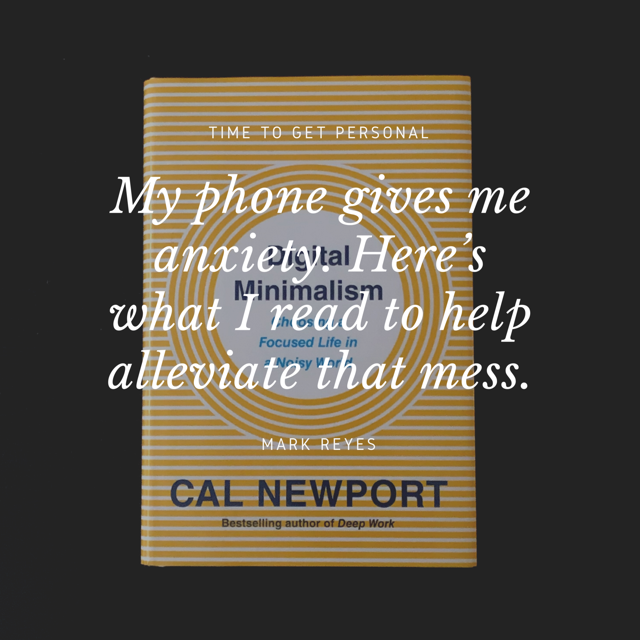

## **Introduction**

_[Digital Minimalism](https://amzn.to/2XSZY1R)_ by Cal Newport is an important book that I’ve picked up in the last decade. It’s a pretty bold statement to make but for me personally, I was in the market for something which could help me out with some mental stress that I’d been carrying over my head. At the core of it all, the root cause is my iPhone. It’s been a great tool to have but it’s also come at a cost. And those tiny apps which sit inside of that expensive piece of machinery has caused me a ton of mental headaches, social anxiety and has misled me many times over with misinformation and half baked conversations.

Frankly, if I could summarize it, I felt sad. So I turned to this book in hopes of finding clarity in this gruesome situation and I wanted to share some of the things I thought were worth mentioning.

## **Summary**

In short, Cal breaks down this form of anxiety from the very beginning. You should know this by now. 2004 and The Facebook takes hold. Then it’s 2007, roughly a year out from the Great Recession and Steve Jobs designs what Apple deemed to be the best iPod yet. Harnessing both the telephone and music player capabilities into one device, the iPhone was never originally presented as segue into mobile apps or the app store as one would assume.

Through a series of short chapters, a total of 7, he takes you on this well explained journey: "A Lopsided Arms Race", "Digital Minimalism", "The Digital Declutter", "Spend Time Alone", "Don’t Click 'Like'", "Reclaim Leisure", and "Join the Attention Resistance".

## **What's Important**

Cal defines the meaning of Digital Minimalism quickly as,

>
> “A philosophy of technology use in which you focus your online time on a small number of carefully selected and optimized activities that strongly support things you value, and then happily miss out on everything else.”

Addiction - not only relates to alcohol and drugs but is thoroughly explained in relation to our digital consumption too. Two forces in particular are explained: intermittent positive reinforcement and the drive for social approval. It’s a pretty nasty explanation on how the Like button impacts us.

"A Lopsided Arms Race" is worth reading over and over.

Digital Declutter - in summary this is essentially a proposal of blunt force trauma to your current digital usage. It’s a cold turkey technique of 30 days where he emphasizes that “aggressive action is needed to fundamentally transform your relationship with technology.”

To me, every process and thought explained in this book are equally important but "Join the Attention Resistance" has to be what Trevor Hoffman was to the San Diego Padres. It’s the closer and the final chapter in giving actionable advice to address this problem.

- Practice: Delete Social Media From Your Phone
- Practice: Turn Your Devices Into Single-Purpose Computers
- Practice: Use Social Media Like a Professional
- Practice: Embrace Slow Media
- Practice: Dumb Down Your SmartPhone

## **Conclusion**

For me, what didn’t work was digital declutter, so I compromised. I tried a cold turkey schedule every fourth week of the month. That worked once and my remaining attempts failed. So I tinkered and ended up using small wins which for me just add up. I removed Facebook and Twitter for good from my phone. I need a laptop when I dip into those worlds.

All notifications for social media are turned off. And it’s really changed the way I frame other apps when I see them come to market. Long story short, I’m not on Tik Tok. It’s one of those scenarios where I continue to say to myself that if I never had it in the first place, I never really missed it.

I don’t look down on my past usage but I am moderately more assertive of what I’m doing when I’m inside of that Instagram game, a Messenger Chat or scrolling through a feed. And for now that’s step one which was definitely better than yesterday, when there were no steps at all.

* * *

<iframe src="https://castbox.fm/app/castbox/player/id2933770/id280819822?v=8.22.11&amp;autoplay=0" frameborder="0" width="100%" height="500"></iframe>

* * *

This post may contain affiliate links. Should you make a purchase by clicking on any of the links, I may earn a commission at no extra cost to you. Read my full [affiliate disclosure](http://www.marklreyes.com/affiliate-disclosure/) here.
