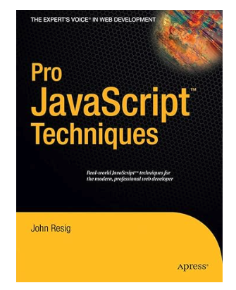

TLDR – _#quarantineandchill_ gave me the opportunity to read a JavaScript book from 2006 by jQuery creator, John Resig. What could possibly be relevant? Parts 3-5: _Unobtrusive JavaScript_, _Ajax_ and _The Future of JavaScript_.

* * *

## **Introduction**

Books. How many of us have them? I for one have several but just because I own a collection doesn’t mean I’ve read them all. I’m trying to improve on that habit and in doing so, I recently discovered a purchase which I had not touched at all.

What adds to the problem is that this is a tech book and for those of you who’ve touched on this type of literature, you know that it can be a very dry read.

That said, this book was and is for the most part still an important one to highlight. For all the web development addicts out there, this contribution is from John Resig, the creator of jQuery. His book, _[Pro JavaScript Techniques](https://amzn.to/3q2a6BP)_ is almost 350 pages of content breaking down JavaScript implementations for commonplace interactions. Here’s the kicker - this book has a copyright of 2006 but there is a 2015 [second edition](https://amzn.to/36eG061).

## **Summary**

Ironically, I could very well say that all chapters are important but that defeats the purpose. However, when tying in the lessons to modern day problems, three specific parts are very much everlasting:

### ✅ **PART 3 Unobtrusive JavaScript**

#### Chapter 5: [The Document Object Model](https://github.com/Apress/pro-javascript-techniques/tree/master/Chapter05)

Take a tour of the HTML you use routinely through the perspective of the DOM. Here, you'll take a glimpse of what the makeup of an HTML element looks like from JavaScript's point of view, what you can do with it, how you can access it (by selector, XPath, etc.) and its surrounding parts like text, siblings and attributes.

#### Chapter 6: [Events](https://github.com/Apress/pro-javascript-techniques/tree/master/Chapter06)

Go head first into the crucial aspects of event bubbling, capturing and canceling. This deep dive will teach you how to tie user-driven behavior to an HTML element of your choice (e.g. clicking a button tag) and how that event is managed should more HTML be encapsulating that element. You'll also learn ways on overwriting default web browser behavior (e.g. clicking an anchor tag - you may not want it heading into another page).

#### Chapter 7: [JavaScript and CSS](https://github.com/Apress/pro-javascript-techniques/tree/master/Chapter07)

Use plain ol' vanilla JavaScript to access an element's current style properties or create them on the fly, determine the x and y position of any element you reference, toggle visibility, animations, examine the viewport and play around with scrolling behaviors.

But the drag and drop section referenced some older technologies like `script.aculo.us` and `moo.fx`. I'd say it's worth the read if you want to simply review on how code was organized. On the basis of that alone, it's pretty clean (see [Module Pattern](https://addyosmani.com/resources/essentialjsdesignpatterns/book/#modulepatternjavascript) by Addy Osmani).

#### Chapter 8: [Improving Forms](https://github.com/Apress/pro-javascript-techniques/tree/master/Chapter08)

In my opinion, this section alone is the BIGGEST win. Learn form validation in an exceptionally straightforward way. The markup alone is crystal clear and when you add John's opinion on layering in validations for required fields, pattern matching and displaying error messages, it creates for a fairly strong HTML form for everyday use. I'd recommend you visit the [codebase](https://github.com/Apress/pro-javascript-techniques/tree/master/Chapter08) for more details.

### ✅ **PART 4 Ajax**

#### Chapter 10: [Introduction to Ajax](https://github.com/Apress/pro-javascript-techniques/tree/master/Chapter10)

> While deceptively simple, the concept of Ajax web applications is a powerful one.
>
> Chapter 10: Introduction to Ajax (p. 232)

John provides a rundown of the full Ajax process and what's involved with the HTTP request and response. He also provides insight on error handling and the types of data that gets passed back and forth between client and server. If you're a server-side developer that makes APIs for a living, you would appreciate this chapter.

### ✅ **PART 5 The Future of JavaScript**

#### Chapter 14: [Where is JavaScript Going?](https://github.com/Apress/pro-javascript-techniques/tree/master/Chapter14)

If you believe hindsight is 20/20 then give this chapter a go. Let expectations meet reality and observe what really did take place like _Array Extras_ (p. 289-90) and _Let Scoping_ (p. 290). Gloss over on what could have been by way of _[Comet](https://en.wikipedia.org/wiki/Comet_\(programming\))_ (p. 301-03).

## **Conclusion**

So, why did I bother with such an old book? A lot of us have John Resig to thank for not pulling our hair out when dealing with Internet Explorer. For those of you entering the field now, this comment holds zero weight but for those of us who developed sites and apps which pre-date the original iPhone and Google Chrome, know how much of a pain it was to equalize the playing field in what was then an IE6 marketplace. This book offered options on how to address the browser ecosystems of that time.

If taking this writeup at face value, you’ll want to ensure you are at minimum, a solid beginner at web development. Understand your HTML and CSS first, then you can begin to ponder why you’d need JavaScript in the first place. Rightfully so, this book (and I assume its 2015 follow-up) fits the bill for beginners and intermediates. If you feel you are far past this level, this book is not for you.

But for me personally, it was worth the time to at least leaf through these pages once before I set it back on the shelf. Some comments still hold true to this day (especially PARTS 3 and 4) and that’s ultimately what drove me to come full circle with the book as JavaScript sets foot into the next decade.

* * *

This article appeared on [ISSUE 517](https://javascriptweekly.com/issues/517) of _JavaScript Weekly_. I’ve found Cooper Press to be a great resource in sending out weekly emails pertinent to all aspects of web technology. If you haven’t yet, [subscribe](https://javascriptweekly.com/) to them for FREE!

* * *

This post may contain affiliate links. Should you make a purchase by clicking on any of the links, I may earn a commission at no extra cost to you. Read my full [affiliate disclosure](http://www.marklreyes.com/affiliate-disclosure/) here.
