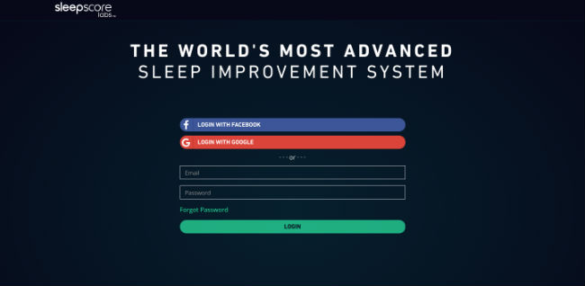
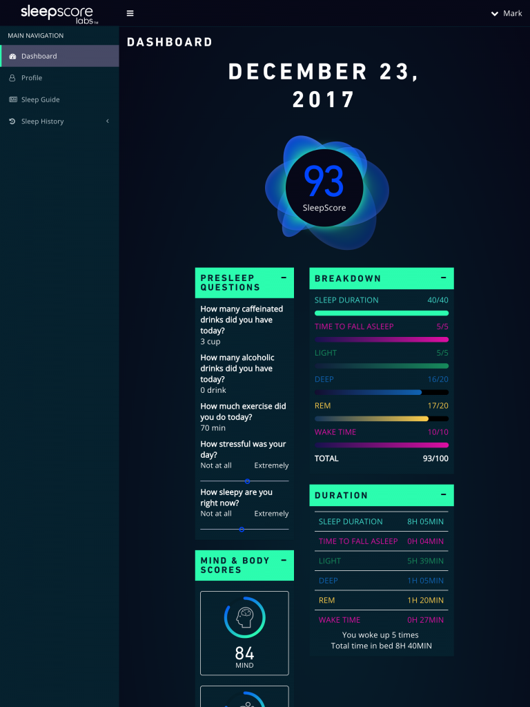
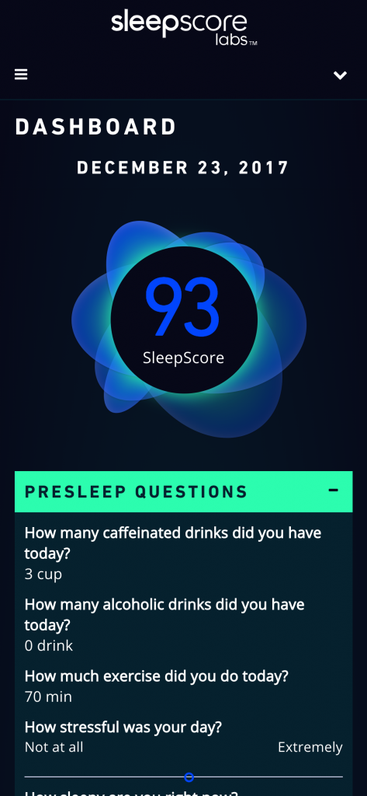

In April of 2017, I was tasked with design and development of a data visualization dashboard for new customers of [SleepScore Max](https://shop.sleepscore.com/), a non-contact sleep improvement system. Designed for both iOS and Android users, my role was to build a web application which would compliment this sleep solution experience by connecting the dots between sleep data and pragmatic advice in a more robust fashion.

I took it upon myself to go head first into Angular (granted my previous experience with AngularJS) but I got a first-hand view of how different both JavaScript frameworks were.

\[caption id="attachment\_431" align="alignnone" width="650"\] SleepScore Max login page written in Angular.\[/caption\]

I kickstarted this project prior to the full standardization of Angular CLI so I was pretty much left to my own devices on how to properly build and deploy this application into a cloud instance.

I credit PluralSight author [Deborah Kurata](https://www.pluralsight.com/authors/deborah-kurata) as the initial key to making this project work. Specifically, her course in [Angular: Getting Started](https://www.pluralsight.com/courses/angular-2-getting-started-update) was a jaw-dropping course on Angular's moving parts. Needless to say, now that I have both AngularJS and Angular perspectives, my best assessment on distinguishing between AngularJS and Angular is that while AngularJS thinks of drafting features from controllers and scope, with Angular you need to abstract those things via components.

To dumb it down for me, I've come to think of a component as simply a web page (the overall object), while the super powers you write inside of that web page act as the methods and properties of that web page. Coming to that conclusion wasn't linear. I needed to dive into TypeScript since it is the driving force in authoring modern Angular apps.

I'm still tinkering with TypeScript and have a long way to go to understand its full value but I definitely became a fan simply because it makes a JavaScript author a bit less error prone. Let's face it, web browsers are still running JavaScript in ES5 and not ES6. Having that superset above JavaScript to reinforce little things like the data-type of an object is awesome and learning how to write a component in TypeScript helped reinforce how I've dumbed down the difference between AngularJS and Angular.

\[caption id="attachment\_433" align="alignnone" width="625"\] A splash of jQuery animation for the sleep score petals, CSS styling to chart out the breakdown all inside of an Angular dashboard.\[/caption\]

\[caption id="attachment\_434" align="alignnone" width="473"\] Yes, this dashboard is also responsive.\[/caption\]

What's next? I'm already thinking about the upgrade path into Angular version 5, smoothening out continuous integration and making Angular CLI the gold standard for facilitating all portions of this project.
