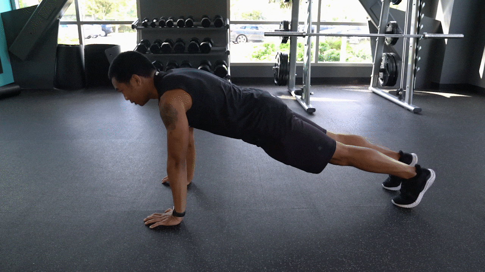

A fun side project I participated in for SleepScore Labs Summer 2019 fitness program - a 5 week total body workout incorporating cardio, calisthenics while integrating better sleep habits into your overall health and wellness routine. Are you up for the challenge? [Sign up](https://www.sleepscore.com/summer-body/) now!

<figure>

<figcaption>

A snap shot of Summer Body's week 1 protocols -3 sets of 15 push ups.

</figcaption>

</figure>

<figure>

<figcaption>

A snap shot of Summer Body's week 1 protocols -3 sets of 16 ski jumps.

</figcaption>

</figure>
