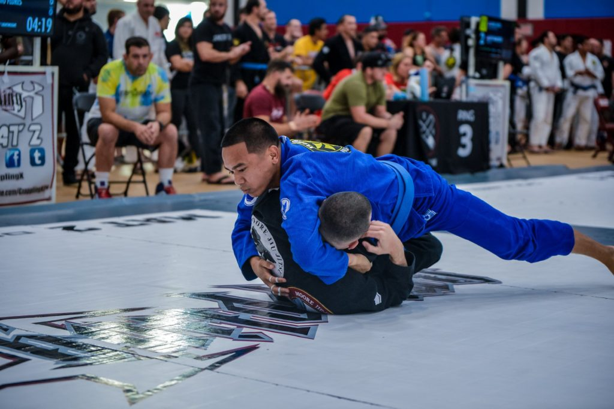

After an individual campaign of [$800+](https://wecan.tapcancerout.org/markreyes) it was time to get to work.

<figure>

<figcaption>

My attempted guillotine choke fails because I'm stuck in his half guard. That nullifies my leverage to properly place him on his back to position my wrapping arm.

</figcaption>

</figure>

I started out strong but was unable to maintain a dominant series and ended the match through points. There are several personal lessons for me on this one and as long as I am of sound mind and body, I will continue to pursue my development in Brazilian Jiu Jitsu.

That said, the overall event exceeded it's goal with a final tally of $150K+. My donation page is still very much active, so please consider a [donation](https://wecan.tapcancerout.org/markreyes) to Tap Cancer Out which directly benefits [Alex's Lemonade Stand](https://www.alexslemonade.org/about/meet-alex) and their mission to change the lives of children with cancer through funding impactful research, raising awareness, supporting families, and empowering everyone to help cure childhood cancer.

<iframe width="560" height="315" src="https://www.youtube.com/embed/_xvZGZ1sL_M?rel=0" frameborder="0" allow="accelerometer; autoplay; encrypted-media; gyroscope; picture-in-picture" allowfullscreen></iframe>
