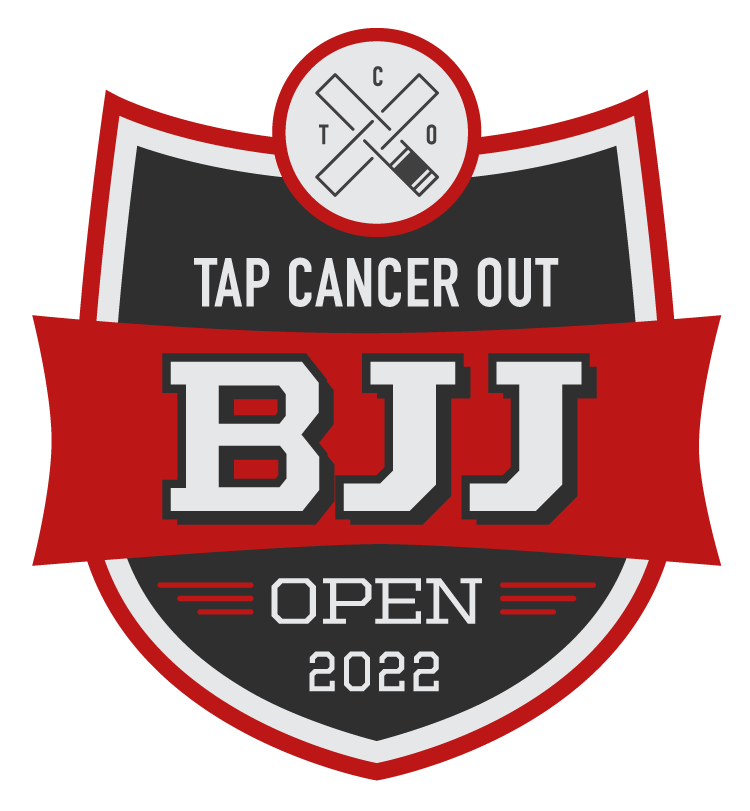

<figure>

<figcaption>

[**February 12, 2022 in San Marcos, California**](https://wecan.tapcancerout.org/marklreyes)

</figcaption>

</figure>

Hey everybody it’s Mark! I need to put the keyboard down for a moment in favor of a special announcement – I will be competing in a tournament called Tap Cancer Out 2022, which will be held February 12th in San Marcos, California.

It’s for a special cause, if you will, for kids with cancer. Specifically, Alex’s Lemonade Stand and more. This is definitely a different kind of grappling competition but the same sport still applies...Jiu Jitsu.

[So please check it out](https://wecan.tapcancerout.org/marklreyes). I would really appreciate any monetary donation that you could do for this organization. Thank you in advance and I appreciate your time.

Aloha! 🤙🏾
