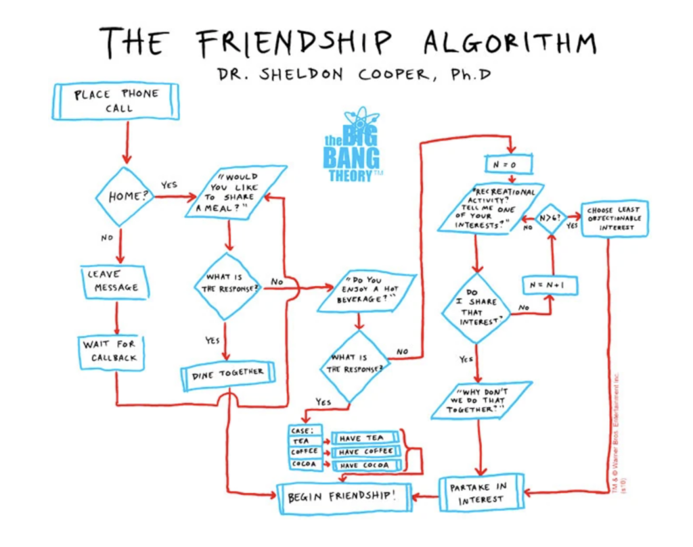

I'm a big fan of [The Big Bang Theory](http://www.cbs.com/shows/big_bang_theory/) and I couldn't resist playing around with Sheldon's friendship algorithm. It's pretty much one object represented as `Sheldon` guided by the module pattern (thanks to [Addy Osmani](http://addyosmani.com/resources/essentialjsdesignpatterns/book/#modulepatternjavascript)).

I encourage you to [fork](https://github.com/marklreyes/The-Friendship-Algorithm) this code and get some zen coding in. Since the logic is "safely" protected by `Sheldon`, you should be able to integrate any boilerplate of your choice for some fun interfaces. Also, feel free to refactor the logic when needed. It could always be better. That said, kudos to Wolowitz for plotting out the loop counter and escape.



To demo this in real-time, pop open your browser's dev tool, navigate to the console and run:

```
	//Open your console right now and run this.
	Sheldon.ask();
```

<script>/* * the BiG BANG THEORY * Season 2, Episode 13 * The Friendship Algorithm */ var Sheldon = (function () { var shareMeal = function () { var letsEat = prompt("Would you like to share a meal? Yes or no?").toLowerCase(); <div></div> if (letsEat == 'yes') { var excellent = alert("Excellent. Let's dine together and begin our friendship!"); return excellent; } else { shareDrink(); } }; <div></div> var shareDrink = function () { var letsDrink = prompt("Alright, do you enjoy a hot beverage? Yes or no?").toLowerCase(); <div></div> if (letsDrink == 'yes') { var popChoices = prompt("Excellent. Popular choices include tea, coffee, cocoa?").toLowerCase(); switch (popChoices) { case "tea": alert("Let's have " + popChoices + " together and begin our friendship!"); break; case "coffee": alert("Let's have " + popChoices + " together and begin our friendship!"); break; case "cocoa": alert("Let's have " + popChoices + " together and begin our friendship!"); break; default: alert("I'm sorry , I don't do " + popChoices + ". What about a recreational activity? I bet we share some common interests!"); shareInterest(); break; } } else { alert("What about a recreational activity? I bet we share some common interests!"); shareInterest(); } }; <div></div> var shareInterest = function () { //Since Sheldon will say no to everything, this object is absolutely false. var sheldonsInterests = false; <div></div> //Create the replied interests and the array it will be assigned to. var yourInterests; <div></div> //Sheldon won't agree with you, period. if (yourInterests === sheldonsInterests) { //This doesn't need to be here but wishful thinking doesn't hurt. alert("Why don't we do that together? Let's partake in " + yourInterests + " and begin our friendship!"); } else { <div></div> //Create the array that the interests will be assigned to. var collectResponses = []; <div></div> //Howard's loop counter. var n = 0; while (n < 10) { n++; yourInterests = prompt("Tell me an interest of yours?").toLowerCase(); //Update the resonse and store it into the collection collectResponses.push(yourInterests); alert("Really, " + yourInterests + "?! I don't do " + yourInterests + "."); <div></div> if (n > 6) { //Randomly choose the least objectionable interest. //I don't know what goes on in Shelly's mind so let's randomly choose. var shellysRandomChoice = collectResponses[Math.floor(Math.random() * collectResponses.length)]; alert("Why don't we do that together? Let's partake in " + shellysRandomChoice + " and begin our friendship!"); break; } } } }; <div></div> return { ask: function () { shareMeal(); } }; })(); <div></div> document.addEventListener("DOMContentLoaded", function() { //Do some zen coding here. //Also, don't forget to have Sheldon make friends, so uncomment the line below! //Sheldon.ask(); }); <div></div></script>
