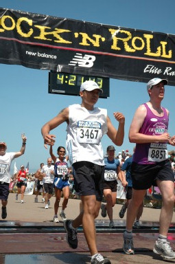
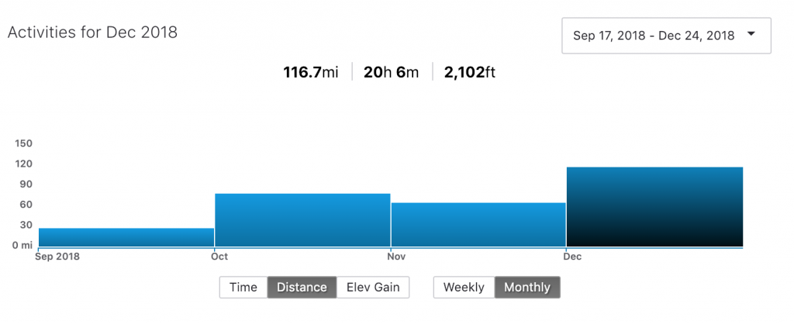

> ## "Have you ever run a marathon?"

In the words of Michael Scott I should've just said,

<iframe class="giphy-embed" src="https://giphy.com/embed/12XMGIWtrHBl5e" width="480" height="392" frameborder="0" allowfullscreen="allowfullscreen"></iframe>

Ok...maybe that was a bit extreme but that's the rabbit hole I found myself spiraling into at the onset of September 2018. I thought it was just another casual day in the office - copy/pasting code from Stack Overflow 😏, _learning_ Spanish (different story...different day...) and establishing myself as The 🐐 in startup foosball.

But no, not today. This question was floating [in the air](https://youtu.be/MN3x-kAbgFU) that day and once two of my colleagues caught wind of my nod, my life quickly turned into [this](https://youtu.be/RLgI-qbrWVo).

### **Contemplation**

Several days later the initial trauma was gone. But everything was set in stone. This was happening. It was not part of any plan I had for the remainder of the year but oh well. It was what it was. I quickly had to find a way to add this demand to my frickin' life. Yay 😑.

🎯 My target, [Surf City Marathon on February 3, 2019](https://www.motivrunning.com/run-surf-city/).

🏆 My goal, **ANYTHING under 4 hours** (e.g. My Time <= 03:59:XX).

Why so specific? Well, I already rode this struggle bus back in 2008 and the final outcome was a total net time of **04:21:43**.

 It Will Be Fun, They Said.\

I had real data. SWEET. Now was the time to use it.

### Preparation

So, here I am 10+ years later with a specific goal in mind. 4 months to train. Let's do this.

But first,

<iframe class="giphy-embed" src="https://giphy.com/embed/5xtDarqlsEW6F7F14Fq" width="480" height="270" frameborder="0" allowfullscreen="allowfullscreen"></iframe>

Several flutes later, I managed to write down what I needed to address this. Here's what it looked like:

#### Checklist

✔️ Download Strava App. ✔️ Kick the dust off of my Nike FuelBand. _Derppp_...I mean download the Nike Run Club App. ✔️ Find a running community (aka peer pressure from work colleagues). ✔️ Purchase running tank tops. ✔️ Purchase running shoes (back to this later 🤔). ✔️ But more importantly, purchase short shorts.

<iframe class="giphy-embed" src="https://giphy.com/embed/7pEIpqWls5S2Q" width="480" height="353" frameborder="0" allowfullscreen="allowfullscreen"></iframe>

Okay, I'll be honest. I'm pretty much covered in DRI FIT.

NIKE, if you can hear me, **CALL ME** 😉.

## Action

I initially committed to three days (2 short, 1 long) a week with a blend of ladders, intervals or simply just getting out there. A total of 3 to 6 miles per attempt, I knew I had to increment up the long runs (6+ mi) but starting from the ground up, this was a solid approach.

Okay, more fessing up. I tried doing all of this by just eyeballing but honestly, listening to your heart can only give you so much. Get a guided run from your running apps. This guy in particular, [Coach Bennett](https://www.nike.com/us/en_us/c/running/nike-run-club/global-bennett) is getting me through this sh\*t.

But Sweet Baby Jesus time flies by fast. At the time of this writing, I'm less than 5 weeks away from the starting line and this is how it looks at scale:

I'll plop a follow-up to this post once the race is done.

Simply put, I'm just putting as much in the bank as I possibly can. January is coming in hot and I want to ensure I do this right and for me that means socializing this madness with my colleagues, getting insight from better runners and just wiring up the laces to get after it. The marathon will come. I just need to be there.

Happy New Year to you the reader for patiently reading this mild rant (I hope you get something positive out of this) and an additional kiss to all the Russian bots that follow my blog.

Aloha 🤙🏾
