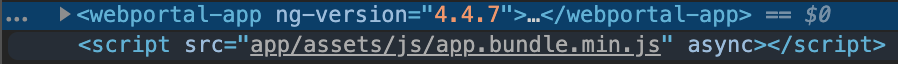
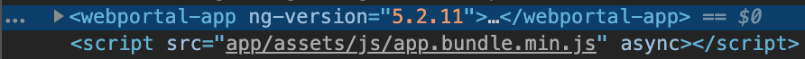

TLDR - it was the Spring of 2020 and one of my company's web properties was on the final version of Angular 4. At the time of this writing Angular 9 had already been in production and I thought hey, why not go all in and address some technical debt with a modest upgrade from v4 to v6. Expectations and reality intervened and I upgraded to v5 instead.

* * *

<figure>

<figcaption>

Getting from here...

</figcaption>

</figure>

<figure>

<figcaption>

to here...INTERESTING.

</figcaption>

</figure>

* * *

## Introduction

I finally had a window of opportunity to do an upgrade on an original Angular 2 app I developed in 2017 and I wanted to capitalize on that period of time to finally get the web app closer to the modern day benefits newer versions of Angular showcased (e.g. Angular CLI, Webpack as a module bundler, ahead of time compilation, tree shaking, etc.).

I had done upgrades for this web app in the past (e.g. 2.0 ➡ 2.4 ➡ 4.0 ➡ 4.7) but in my heart of hearts I knew this was going to be different as the [Angular Team's opinion](https://blog.angular.io/the-past-present-and-future-of-the-angular-cli-13cf55e455f8) on how to build their web apps became standardized. To ensure these notions I went head first into [StackOverflow](https://stackoverflow.com/questions/61489957/advice-insight-how-to-safely-update-an-angular-4-app-to-angular-6/) to field opinions outside of my own and two bold statements from the community said it all:

> This is not trivial.
>
> [user3791775](https://stackoverflow.com/users/3791775/user3791775)

> Man... no shortcut.
>
> [julianobrasil](https://stackoverflow.com/questions/61489957/advice-insight-how-to-safely-update-an-angular-4-app-to-angular-6/61492826?noredirect=1#comment108789500_61492826)

## First Pass

So here I am, shooting for the stars and immediately I knew that if I wanted to do this, I'd have to go head first into the Angular CLI and bootstrap the foundations of this app in that fashion. I already had a seed project in a separate repository _just in case_ I had the chance to do this. That, plus the guidance of [_Angular Update Guide_](https://update.angular.io/#4.4:6.1l3), I felt compelled and ready to go.

In my view, I would be checking off every applicable box and then could immediately leverage the little things I'd been reading about for so long. Kickstart a localhost quickly, generate components and services dynamically with a select few keystrokes and allowing for Webpack to take lead in bundling up the final artifacts.

My first impressions were promising but as I immediately copy pasted the old code base over you immediately saw breaks. Localhost would not compile for a collection of different reasons which would scream in red on the command line. On the basis of that alone, I knew this was going to be an upward climb. Rather than focusing on the screams, I became more enamored with understanding the tooling behaviors versus addressing the core problem on hand - simply make the app work. To me, trying to flex that much CLI in one go was a bit egotistical and I was just too distracted. I lost time on this alone and I should have just played dumb in the short term and invested my time on the errors on hand.

## The Gotchas

### httpClient vs. HttpClientModule

If you've wrapped your web app with reusable services to perform the HTTP calls, you're in for a treat when replacing `httpClient` in favor of `HttpClientModule`. In my case, I had to go through all of the necessary services and double-check how I was returning the response and error from the backend because JSON is now defaulted as the object to return back to the component. This means that any component which performs a `subscribe()` call should no longer evaluate the response or error through `JSON.parse()` methods.

### SystemJS vs. Webpack

The original bundler, SystemJS went hand-in-hand with GulpJS as its task runner to perform the final build. Webpack's bundler is completely stand alone. That in itself, was demanding to reconfigure. So heads up, if you're going all in with rewriting that portion - it's not straightforward. I parked this effort. I didn't have enough time.

### Starting From Scratch - WHY?!

What probably got me undone was how wide of a gap v4 was to v6. After several headaches, I needed insight outside of my own. And after consulting with another developer it was best to scrap such a tall order in favor of something more achievable. What undid me as well (although I still recommend doing it this way) was the fact that I kept a separate repository. At first pass, I needed to do it that way in order to fully see how a modern day Angular app gets built. Visually, it was easier to see how a project was seeded and with code structures pre-populated (e.g. App Module, Components, etc.), it was easier to digest. But alas, once I started porting the old code over, line-by-line fixes proved cumbersome.

My road to Angular 5 began immediately. Under that notion, I maintained the original repository (and all its commit history) and updated `package.json` accordingly with v5 specifications. Out of gas, I said _f\*ck it_. Let it ride.

## Next Pass

I scoped the original effort for a single two-week sprint. It spilled over immediately into the next but I knew I was close since localhost was working flawlessly under v5 updates. Now, it was a matter of smashing through the interactions, component by component. I checked off whatever applicable boxes were advised from _Angular Update Guide_ and for the most part, tackling through `httpClient` was the majority of the dirty work. Improbable turned into tedious yet manageable.

Naturally, the bugs surfaced. But most of the bugs occurred due to previous implementations of the legacy `httpClient`. That said, it would not have been as obvious if existing coverage was not in place. When bugs were reported, it led to faster diagnosis and turnaround time on tightening up the screws. Some DevOps tweaking had to be done (NodeJS upgrade from v10 to v12, namely) but thankfully there was nothing on that side which led to extreme hardships.

One thing I forgot to mention was the topic of testing. Prior to this, I already had the luxury of having a test automation engineer provide existing code coverage on production. This was my insurance policy. I knew before hand having that coverage empowered me with enough runway to perform an upgrade.

## Conclusion

I knew this wasn't going to be cake - it was by far the most difficult upgrade path because of what other dependencies had to ship along with it. It took 1 sprint and 1 day to get this loaded into an environment. In hindsight, had I not involved myself with v6 and just stuck to a v5 upgrade, it would have been half a sprint and 1 day, tops. I know there are a few stones left unturned (currently not all in on the Angular CLI, SystemJS is still the module bundler, etc.). But hopefully, this puts the web app and any future developer who inherits this code into closer opportunities with modern day Angular capabilities.

I wrote this post with hopes of reaching out to JavaScript Developers facing similar constraints. You might be hired to work on a legacy app. You might be a team of one. You might not have the luxury of starting a project from scratch. Whatever the obstacle may be, I hope you pull the value you need from this story. If you feel that the tech moves extremely fast but the tech articles move even faster, you aren't alone. Those tempos won't necessarily match the speed and decision making of your business owners but that's not a penalty on them. It's on us and it's the premium we pay for working on this side of technology.

For what it's worth, my advice is this—take a moment to reflect and do the following below.

First, before thinking of performing such serious upgrades ask yourself about the current state of your test coverage. If you aren't confident, prioritize that now. Yes, it's a feat, but imagine if you didn't have that in your back pocket. Next, don't bet the house a.k.a **do not skip versions**. Then, define your **incremental** wins (e.g. v4 ➡ v5).

Finally - add up those wins and enjoy them. Reflect again. Rinse and repeat.

* * *

This article appeared on [ISSUE 488](https://javascriptweekly.com/issues/488) of _JavaScript Weekly_. I've found Cooper Press to be a great resource in sending out weekly emails pertinent to all aspects of web technology. If you haven't yet, [subscribe](https://javascriptweekly.com/) to them for FREE!
