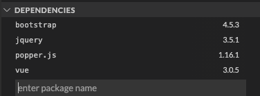
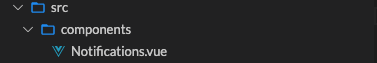

I'm dabbling with Vue version 3. Here's Part 1 of 2 in generating a reusable component.

* * *

## Introduction

Let's build this. A simple Vue app which demonstrates a reusable notification by way of Bootstrap 4 alerts.

<iframe width="100%" height="420px" src="https://stackblitz.com/edit/vue-bootstrap-notifications?embed=1&amp;file=src/App.vue&amp;hideExplorer=1&amp;view=preview"></iframe>

## What's the Goal?

Create a reusable [component](https://v3.vuejs.org/guide/component-registration.html#component-names) that displays different types of notifications.

## What will we need?

- **Stackblitz** - to quickly prototype a Vue project and its dependencies.
- **Bootstrap 4** - to grab some ready-made user interfaces (e.g. [alerts](https://getbootstrap.com/docs/4.0/components/alerts/)).

## Step By Step

### Step 1: Create Vue App

[](https://www.marklreyes.com/wp-content/uploads/2021/01/stackblitz_vue.png)

### Step 2: Install Dependencies

<figure>

[](https://www.marklreyes.com/wp-content/uploads/2021/01/stackblitz_vue_dependencies_notifications.png)

<figcaption>

_Enter additional dependencies such as bootstrap (jquery and popper is optional but I added it anyway)._

</figcaption>

</figure>

### Step 3: Add Dependencies to main.js

```
const { createApp } = require("vue");
import App from "./App.vue";
import "bootstrap"; // Add this import.
import "bootstrap/dist/css/bootstrap.css"; // Add this import.

createApp(App).mount("#app");
```

### Step 4: Modify HelloWorld.vue Component

Out of box, Stackblitz generates a default Vue project paired with a component called `HelloWorld.vue.`

<figure>

[](https://www.marklreyes.com/wp-content/uploads/2021/01/stackblitz_vue_componenet_notifications.png)

<figcaption>

We'll repurpose most of this by first renaming it to `Notifications.vue.`

</figcaption>

</figure>

#### The Component Code

Debrief of the _Notifications_ component [code](https://stackblitz.com/edit/vue-bootstrap-notifications?file=src/components/Notifications.vue):

- **Line 2:** class binding is assigned passing in a type object.
- **Line 3:** apply a [slot](https://v3.vuejs.org/guide/component-slots.html) so HTML can be used in full.
- **Lines 13-15:** the prop defined to pass in what type of alert to display.

Debrief of the _App_ component [code](https://stackblitz.com/edit/vue-bootstrap-notifications?file=src/App.vue):

- **Lines 12-14:** type attribute will pass in the specific bootstrap class to style the alert.
- **Line 13:** the HTML from here will be inserted to the slot assigned in the Notifications component.

## Key Takeaways

We've now created a reusable component which is dynamic enough to apply Bootstrap's variety of alerts as well as the ability to pass in a message with full HTML by way of slots.

## Additional Resources

- Vue School's free [component course](https://vueschool.io/courses/vuejs-components-fundamentals).
- Source code for this demo is available on [Github](https://github.com/marklreyes/vue-bootstrap-notifications) and [Stackblitz](https://stackblitz.com/edit/vue-bootstrap-notifications).
