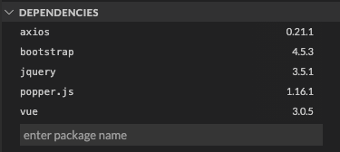
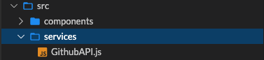

I'm dabbling with Vue version 3. Here's Part 2 of 2 in generating a reusable component. This time with an API call attached.

* * *

## Introduction

Let's build this. A simple Vue app which accesses Github's REST API and prints a user's profile into a Bootstrap 4 card interface.

<iframe width="100%" height="420px" src="https://stackblitz.com/edit/vue-bootstrap-githubprofile?embed=1&amp;file=src/App.vue&amp;hideExplorer=1&amp;hideNavigation=1&amp;view=preview"></iframe>

## What's the Goal?

Create a reusable [**component**](https://v3.vuejs.org/guide/component-registration.html#component-names) that displays a person's Github profile.

## What will we need?

- **Stackblitz** - to quickly prototype a Vue project and its dependencies.

- **Bootstrap 4** - to grab some ready-made user interfaces (e.g. cards).

- **Axios** - the promise based library we'll use to communicate with Github's API.

- **Github API** - the data source we'll need to access and display a user's profile.

## Step By Step

### Step 1: Create Vue App

<figure>

[](https://www.marklreyes.com/wp-content/uploads/2021/01/stackblitz_vue.png)

<figcaption>

Visit Stackblitz.com and click the Vue icon to automatically generate a default HelloWorld project.

</figcaption>

</figure>

### Step 2: Install Dependencies

<figure>

[](https://www.marklreyes.com/wp-content/uploads/2021/01/stackblitz_vue_dependencies_github.png)

<figcaption>

Enter additional dependencies such as axios and bootstrap (jquery and popper is optional but I added it anyway).

</figcaption>

</figure>

### Step 3: Add Dependencies to main.js

```
const { createApp } = require("vue");
import App from "./App.vue";
import "bootstrap"; // Add this import.
import "bootstrap/dist/css/bootstrap.css"; // Add this import.

createApp(App).mount("#app");
```

### Step 4: Create a Service for API Call

<figure>

[](https://www.marklreyes.com/wp-content/uploads/2021/01/stackblitz_vue_service_github.png)

<figcaption>

Create a new directory called services and add new file `GithubAPI.js.`

</figcaption>

</figure>

#### The Service Code

Debrief of the _GithubAPI_ service [code](https://stackblitz.com/edit/vue-bootstrap-githubprofile?file=src/services/GithubAPI.js):

- **Line 1:** Import `axios` library for promise based HTTP requests.

- **Line 5:** Write a function called `getGithubProfile()` and pass in `username` as an argument.

- **Line 7:** Leverage the [get](https://stackblitz.com/edit/vue-bootstrap-githubprofile?file=src/services/GithubAPI.js) method and concatenate the `username` variable.

- **Line 9:** Return the `response` object (component will consume this).

### Step 5: Modify HelloWorld.vue Component

Out of box, Stackblitz generates a default Vue project paired with a component called `HelloWorld.vue.` Rename it.

<figure>

[](https://www.marklreyes.com/wp-content/uploads/2021/01/stackblitz_vue_componenet_github.png)

<figcaption>

We'll repurpose most of this by first renaming it to `GithubProfile.vue.`

</figcaption>

</figure>

#### The Component Code

Debrief of the _GithubProfile_ component [code](https://stackblitz.com/edit/vue-bootstrap-githubprofile?file=src/components/GithubProfile.vue):

- **Lines 3-16:** The Bootstrap [card](https://getbootstrap.com/docs/4.0/components/card/).

- **Line 20:** Import the service made from Step 4.

- **Lines 23-28:** The [prop](https://v3.vuejs.org/guide/component-props.html) you'll pass in (e.g. a profile name).

- **Lines 29-33:** Setup Vue's [data](https://v3.vuejs.org/guide/data-methods.html#data-properties) object which will populate the card.

- **Lines 34-42:** Setup the API call inside of the [created](https://v3.vuejs.org/guide/composition-api-lifecycle-hooks.html) lifecycle hook.

Debrief of the _App_ component [code](https://stackblitz.com/edit/vue-bootstrap-githubprofile?file=src/App.vue):

- **Line 13:** the prop passed in as a string (e.g. my profile name).

## Key Takeaways

We've now created a reusable component which is dynamic enough to apply a Bootstrap card by passing in the Github profile as a prop. This will use Github's API to make a call on their end which will print the profile data to the card.

## Additional Resources

- Vue School's free [component course](https://vueschool.io/courses/vuejs-components-fundamentals).

- Source code for this demo is available on [Github](https://github.com/marklreyes/vue-bootstrap-githubprofile) and [Stackblitz](https://stackblitz.com/edit/vue-bootstrap-githubprofile).

- If you want to make a context switch to [React](https://www.marklreyes.com/react-components-bootstrap-card-github-api/), a similar implementation can be found [here](https://www.marklreyes.com/react-components-bootstrap-card-github-api/).
